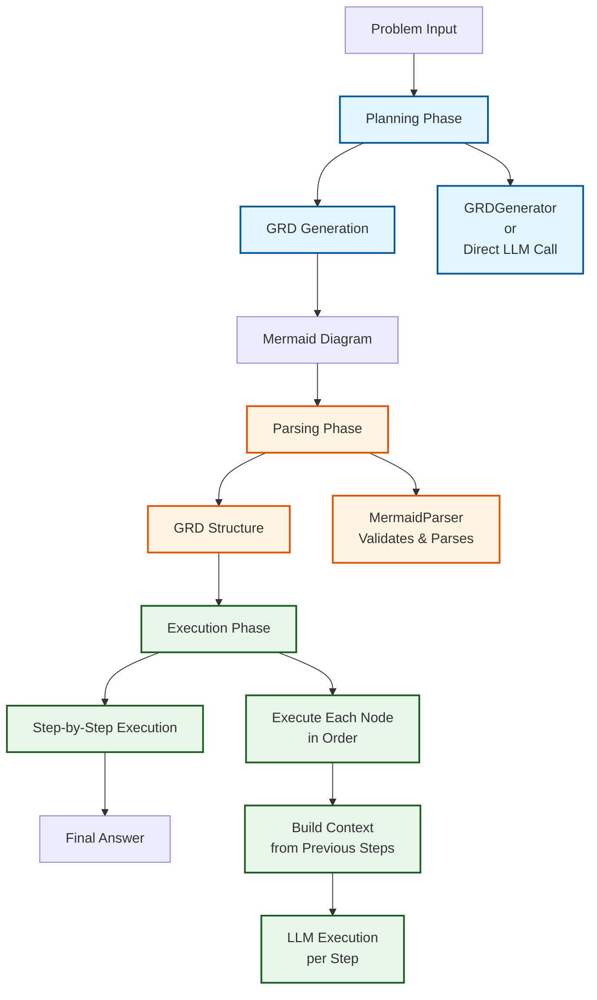
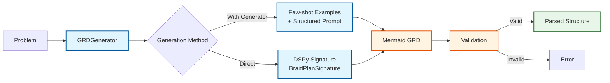
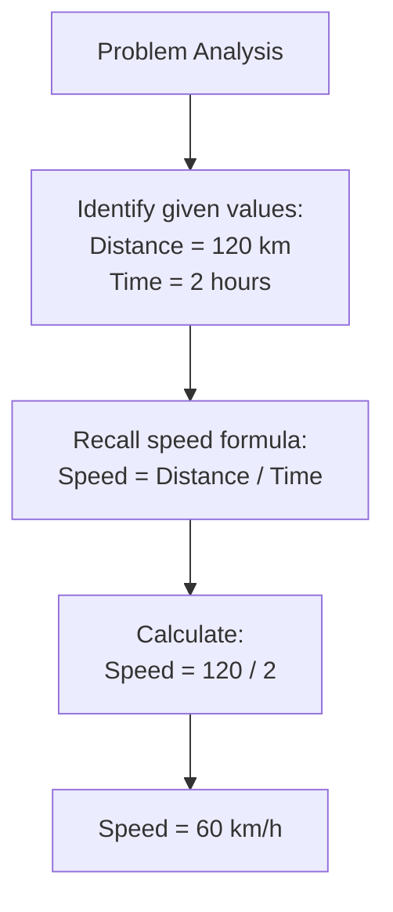
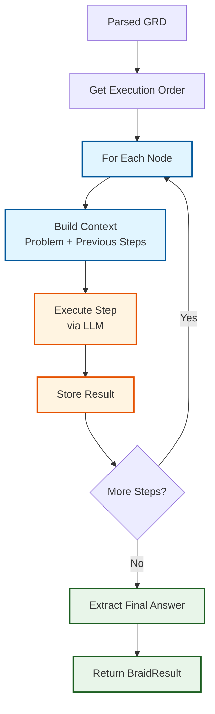
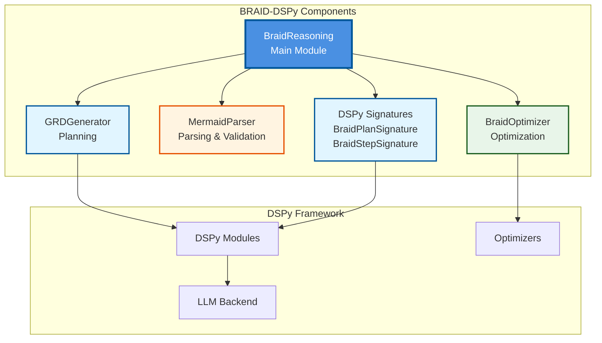
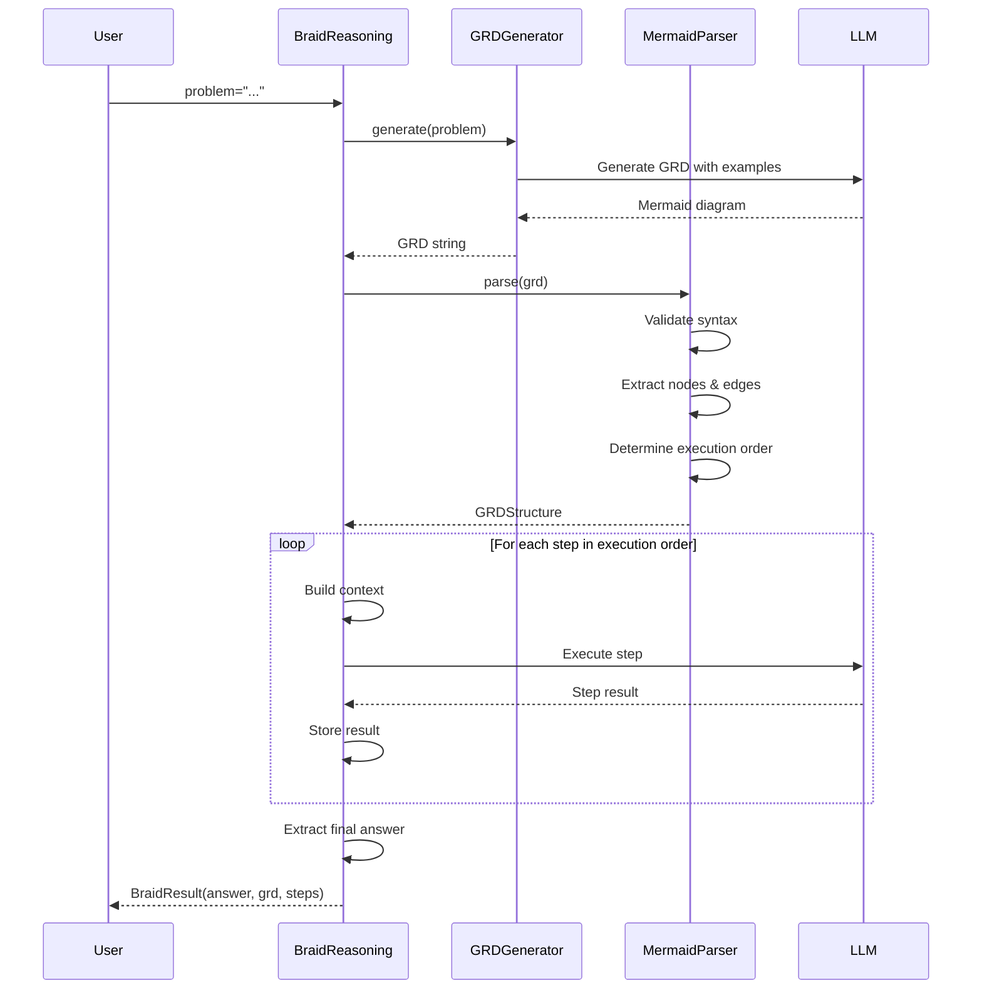

# BRAID-DSPy Integration

[](https://github.com/ziyacivan/braid-dspy/actions/workflows/ci.yml)
[](https://badge.fury.io/py/braid-dspy)
[](https://opensource.org/licenses/MIT)
[](https://www.python.org/downloads/)
[](https://github.com/psf/black)

A Python library that integrates BRAID (Bounded Reasoning for Autonomous Inference and Decisions) architecture into the DSPy framework, enabling structured reasoning through Guided Reasoning Diagrams (GRD) in Mermaid format.

## Overview

BRAID-DSPy brings structured reasoning capabilities to DSPy by requiring models to first generate a machine-readable flowchart (GRD) before executing the solution. This separation of planning and execution significantly improves reliability and reduces hallucinations.

## Motivation

This project began when I first encountered the BRAID architecture during one of [Armağan Amcalar](https://github.com/dashersw)'s live streams. The two-phase reasoning approach — planning first, then execution — and the idea of representing this planning in a visualizable format (Mermaid diagrams) immediately captured my interest.

After the stream, I delved into OpenServ's articles and technical details about BRAID. The approach of having the model first generate a flowchart (Guided Reasoning Diagram - GRD) and then execute the solution step-by-step according to this schema seemed like a significant step forward for reliability and transparency in AI systems. I realized that integrating this architecture with the DSPy framework would need to work seamlessly with existing DSPy modules and optimizers, which led me to develop this library to make that integration a reality.

Much of the development process involved "vibe coding" — following intuition and iterating based on what felt right rather than strictly following a predefined plan. This organic approach allowed the library to evolve naturally as I explored the integration between BRAID and DSPy.

## Key Features

- **Guided Reasoning Diagrams (GRD)**: Generate Mermaid-format flowcharts that map solution steps
- **Two-Phase Reasoning**: Separate planning and execution phases for better reliability
- **DSPy Integration**: Seamlessly integrates with existing DSPy modules and optimizers
- **Auditable Reasoning**: Visualize and debug reasoning processes through GRD diagrams
- **Optimization Support**: BRAID-aware optimizers for improving GRD quality

## Installation

```bash
pip install braid-dspy
```

## Quick Start

```python
import dspy
from braid import BraidReasoning

# Configure DSPy
lm = dspy.OpenAI(model="gpt-4")
dspy.configure(lm=lm)

# Create a BRAID reasoning module
braid = BraidReasoning()

# Use it in your pipeline
result = braid(problem="Solve: If a train travels 120 km in 2 hours, what is its speed?")
print(result.answer)
print(result.grd)  # View the reasoning diagram
```

## Architecture

BRAID-DSPy implements a two-phase reasoning architecture that separates planning from execution, significantly improving reliability and reducing hallucinations compared to traditional Chain-of-Thought approaches.

### High-Level Architecture



### Two-Phase Reasoning Process

#### Phase 1: Planning

In the planning phase, the system generates a **Guided Reasoning Diagram (GRD)** in Mermaid format that maps out the solution steps:



**Example GRD Output:**


#### Phase 2: Execution

The execution phase follows the GRD structure step-by-step:



### Component Architecture



### Key Components

1. **BraidReasoning**: Main module that orchestrates the two-phase process
   - Manages planning and execution phases
   - Handles GRD generation or accepts pre-generated GRDs
   - Executes steps sequentially with context accumulation

2. **GRDGenerator**: Generates Mermaid-formatted GRDs using few-shot examples
   - Uses structured prompts with examples
   - Supports retry logic for robust generation
   - Extracts Mermaid code from LLM responses

3. **MermaidParser**: Parses and validates Mermaid diagrams
   - Converts Mermaid syntax to structured `GRDStructure` objects
   - Validates diagram syntax and structure
   - Determines execution order using topological sorting

4. **BraidOptimizer**: Optimizes both planning and execution phases
   - Can optimize GRD generation quality
   - Improves step execution through DSPy optimizers
   - Supports custom metrics for evaluation

### Execution Flow Example

For a problem like "If a train travels 120 km in 2 hours, what is its speed?":



### Benefits of This Architecture

- **Reliability**: Planning phase ensures structured approach before execution
- **Transparency**: GRD diagrams provide visual reasoning trace
- **Debuggability**: Each step is isolated and traceable
- **Optimization**: Both phases can be optimized independently
- **Flexibility**: Supports pre-generated GRDs or dynamic generation

## Documentation

📚 **Full documentation is available on [Read the Docs](https://braid-dspy.readthedocs.io/en/stable/)**

Local documentation:
- [API Reference](docs/api.md)
- [Examples](docs/examples.md)
- [Integration Guide](docs/integration.md)

To build documentation locally:

```bash
pip install -e ".[docs]"
cd docs
make html
```

## Examples

Check out the [examples](examples/) directory for:
- Basic usage examples
- GSM8K benchmark integration
- Optimization workflows

## Contributing

Contributions are welcome! Please read our [Contributing Guide](CONTRIBUTING.md) for details on our code of conduct and the process for submitting pull requests.

## Changelog

See [CHANGELOG.md](CHANGELOG.md) for a list of changes and version history.

## License

MIT License - see [LICENSE](LICENSE) file for details.

## References

- [BRAID Blog Post](https://www.openserv.ai/blog/braid-is-the-missing-piece-in-ai-reasoning)
- [DSPy Framework](https://github.com/stanfordnlp/dspy)

